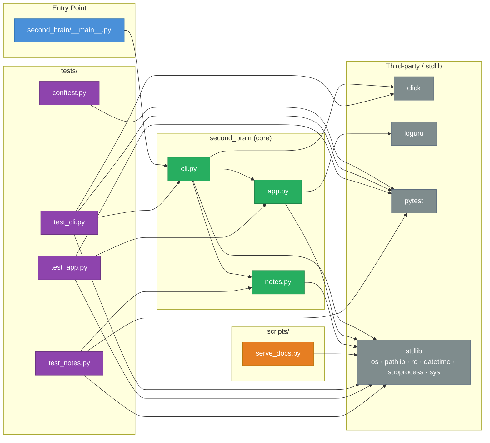

# Module Dependency Map

Shows which modules import from which. No circular dependencies were found.

## Dependency summary

| Module | Imports from | Imported by |
|---|---|---|
| `__main__` | `cli` | *(entry point)* |
| `cli` | `app`, `notes`, click, stdlib | `__main__`, `test_cli` |
| `app` | loguru, stdlib | `cli`, `test_app` |
| `notes` | stdlib only | `cli`, `test_notes` |
| `test_cli` | `cli`, click, pytest, stdlib | — |
| `test_app` | `app`, pytest, stdlib | — |
| `test_notes` | `notes`, pytest, stdlib | — |
| `serve_docs` | stdlib only | — |

## What you can safely change

| Module | Risk level | Notes |
|---|---|---|
| `notes.py` | **Low** — only stdlib deps | Only `cli.py` and `test_notes.py` depend on it. Changes to its public API (`create_note`, `build_note_path`, `slugify`) require updating both. |
| `app.py` | **Low** — only stdlib + loguru | Only `cli.py` and `test_app.py` depend on it. Changing the logging API (`configure_logging`, `console_format`, `main`) requires updating both. |
| `cli.py` | **Medium** | Sits in the middle of the chain. Changes ripple to `__main__` and `test_cli`. The CLI command interface is also the user-facing contract. |
| `__main__.py` | **Low** | Only imports `cli`; changing it only affects the `python -m second_brain` entry point. |
| `tests/*` | **Low** | No production code imports tests; all changes are isolated. |
| `serve_docs.py` | **Low** | Fully isolated — no local imports. |

> **No circular dependencies detected.** The dependency graph is a strict DAG.
